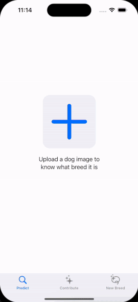

# WhatDog?
An iOS federated learning platform for dog image classification and training

## About
Federated learning, where an ML model is trained and served in the same server, is a great application for platforms where the time to deploy needs to be immediate and also works well for particular use cases such as data collection where users can see the impact of the data they provide instantaneously. 

WhatDog? is an iOS app which acts as a client for my federated learning platform hosted on AWS. The platform is a dog image classifier trained on the Stanford Dog dataset on a sample set of 20 dog classes. Using the app, users can-
1) Predict breeds of dogs by uploading an image of it
2) Contribute to the model's training by providing additional images of supported dog breeds
3) Add a new breed to the ML model by providing a few images and a breed name.

## Features

#### Prediction

#### Contribute pictures

#### Add a new breed

## Author
Sneha Seenuvasavarathan
